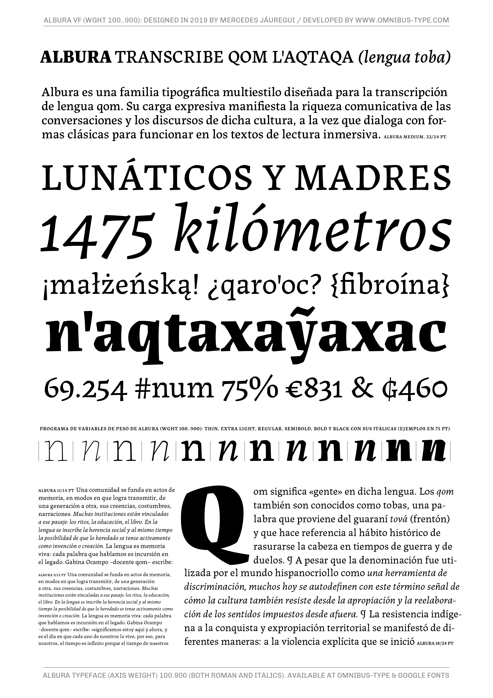

# Albura Family

**Jauregui & Omnibus-Type Team**
*SIL Open Font License 1.1,*
*18 fonts, 877 glyphs each variant*

Albura is a typeface family designed by Mercedes Jáuregui that expresses the communicative richness of the conversations and discourses of the indigenous cultures of oral tradition, at the same time that it dialogues with the classic forms to function in immersive reading texts. This project began in the Master of Typeface Design, MT-UBA, at the Universidad of Buenos Aires, Argentina. 

To contribute to the project contact Omnibus-Type at omnibus.type@gmail.com

#### Albura Family contains:
* Thin /  Thin Italic
* Extra Light / Extra Light Italic
* Light / Light Italic
* Regular / Italic
* Medium / Medium Italic
* Semi Bold / Semi Bold Italic
* Bold / Bold Italic
* Extrabold / Extrabold Italic
* Black / Black Italic

To contribute to the project contact [Omnibus Type](http://omnibus-type.com/).

### Designer

* Mercedes Jáuregui

### License

Copyright (c) 2022, Omnibus-Type (www.omnibus-type.com | omnibus.type@gmail.com).

Licensed under the [*SIL Open Font License, 1.1*](http://scripts.sil.org/OFL); you may not use this file except in compliance with the License.

======
## FONTLOG for the Albura Family fonts

This file provides detailed information on the Albura Family font software.  
This information should be distributed along with the Albura Family fonts and any derivative works.

*To contribute to the project contact Omnibus-Type at omnibus.type@gmail.com*

**ChangeLog**

**06 Dec 2022 (Mercedes Jáuregui) Albura Family v.1.000**
- Initial release under SIL Open Font License

### Acknowledgements

If you make modifications be sure to add your name (N), email (E), web-address (if you have one) (W) and description (D). This list is in alphabetical order.

**N:** **Mercedes Jáuregui**  
**E:** omnibus.type@gmail.com  
**W:** http://www.omnibus-type.com  
**D:** Designer  

**N:** **Eduardo Rodríguez Tunni**  
**E:** omnibus.type@gmail.com  
**W:** http://www.omnibus-type.com  
**D:** Typeface development

**N:** **Oscar Guerrero**  
**E:** omnibus.type@gmail.com   
**W:** http://www.omnibus-type.com   
**D:** Typeface development

**N:** **Aldo De Losa**  
**E:** omnibus.type@gmail.com  
**W:** http://www.omnibus-type.com  
**D:** Assistant Designer

**N:** **Pablo Cosgaya**  
**E:** omnibus.type@gmail.com  
**W:** http://www.omnibus-type.com  
**D:** Assistant Designer

**N:** **Emma Marichal**  
**E:** omnibus.type@gmail.com  
**W:** http://www.omnibus-type.com  
**D:** Assistant Designer 

**N:** **Rosalie Wagner**  
**E:** omnibus.type@gmail.com  
**W:** http://www.omnibus-type.com  
**D:** Assistant Designer 

